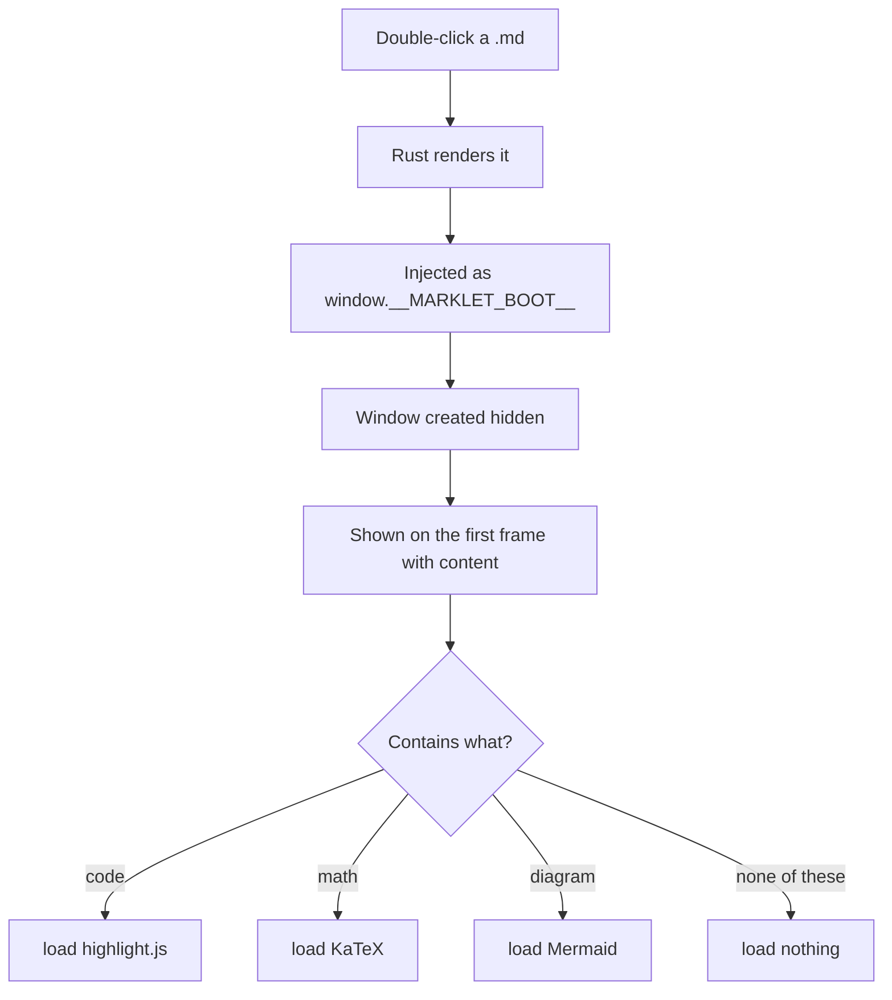
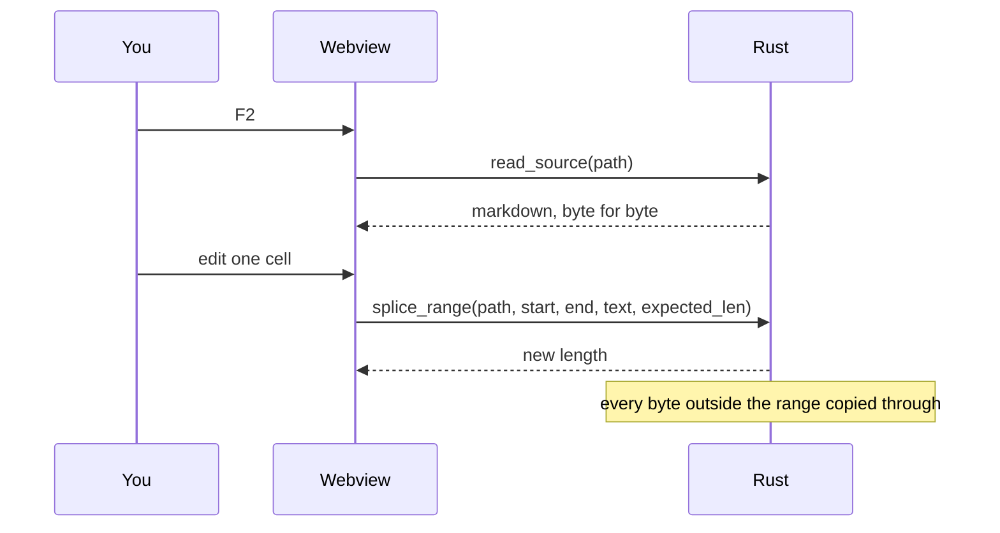

# Marklet demo

Everything Marklet does, in one file, arranged so you can work down it and see each
thing happen. The frontmatter block above this line should **not** appear as text —
if you can read `title: Marklet demo` in the document body, frontmatter parsing is
broken.

> [!NOTE]
> Some sections below need the **full edition** or an **open vault**. Each one says so.
> A section that does nothing in your build is not necessarily a bug — check the label
> first.

---

## 1. The outline

Press the outline control and this document's headings should appear as a tree, nested
by level. Click one: the document jumps there. Scroll by hand: the outline should
follow you, highlighting the section you are actually in.

Every heading in this file has an id derived from its text, so the outline entry and
the anchor agree. This one is `#1-the-outline`.

### A nested heading

### Another at the same level

#### And one deeper still

Three levels of nesting, so the outline has something to indent.

---

## 2. Reading position

Scroll to the bottom of this file, close Marklet, and open it again. You should come
back to where you were, not to the top.

Then change the font size or the column width in settings and reload. You should
*still* be near the same paragraph — the position is anchored to a source line, not
to a pixel offset, so it survives the reflow.

---

## 3. Live reload

With this file open, edit it in any other editor and save. Marklet should update
within a moment, **without losing your scroll position**.

Try appending a line to the end of the file. The document grows; you stay where you
are.

---

## 4. Tables

A plain table:

| Feature | Lite | Full |
|---|---|---|
| Reading, outline, vault | yes | yes |
| Mermaid diagrams | no | yes |
| Regex vault search | no | yes |

Alignment markers, which should actually align:

| Left | Centre | Right |
|:---|:---:|---:|
| a | a | a |
| bbbb | bbbb | bbbb |
| cccccccc | cccccccc | cccccccc |

### The byte-exactness test

This table is aligned **by hand**, with padding spaces. It is the single best test of
the editor's central promise:

| id  | name            | size      |
|-----|-----------------|-----------|
| 1   | lite installer  |    1.55 MiB |
| 2   | full installer  |    3.00 MiB |
| 3   | offline bundle  |  208.01 MiB |

Press `F2`, change one cell in *some other paragraph* of this document, press `Esc`,
then run `git diff` on the file. The diff must not touch this table. If the padding
above has been re-flowed, something has introduced a serializer and the promise is
broken.

---

## 5. Lists

Unordered, nested:

- First
  - Second
    - Third
      - Fourth
- Back to the top level

Ordered, nested, and deliberately misnumbered in the source:

1. One
1. Two
1. Three
   1. Three point one
   1. Three point two

Task lists:

- [x] Render Markdown
- [x] Open a vault
- [x] Edit without a serializer
- [ ] Get somebody to look at the interface
- [ ] Sign the binaries

Definition-ish list via nesting:

- **`F2`**
  - Live preview. Syntax hides on lines your cursor is not on.
- **`F3`**
  - Split view. Source left, preview right, scroll-synced.

---

## 6. Code

Inline `code`, and a `--flag`, and `%LOCALAPPDATA%\Marklet\marklet.exe`.

Rust:

```rust
/// Replaces the bytes in `[start, end)` and copies every other byte through.
pub fn splice(path: &Path, start: usize, end: usize, replacement: &str) -> Result<usize> {
    let bytes = std::fs::read(path)?;
    let mut out = Vec::with_capacity(bytes.len());
    out.extend_from_slice(&bytes[..start]);
    out.extend_from_slice(replacement.as_bytes());
    out.extend_from_slice(&bytes[end..]);
    write_atomically(path, &out)?;
    Ok(out.len())
}
```

TypeScript:

```typescript
export async function serializeEnrichedDocument(root: HTMLElement): Promise<Enriched> {
  const clone = root.cloneNode(true) as HTMLElement;
  for (const node of clone.querySelectorAll('[data-l]')) node.removeAttribute('data-l');
  return { bodyHtml: clone.innerHTML, extraCss: await inlineFonts(katexCss) };
}
```

Bash:

```bash
marklet --install     # register the file association, HKCU only
marklet --unbind      # remove it, leaving no residual keys
MD_HTML=1 marklet demo.md > demo.html
```

JSON, YAML, SQL, diff — the highlighter ships 22 languages, so a few more:

```json
{ "identifier": "app.marklet.viewer", "bundle": { "targets": ["nsis", "deb"] } }
```

```diff
- webview2-com = "0.39"
+ webview2-com = "0.38"
```

A fence with **no language tag**, which should render as plain monospace and not be
highlighted:

```
$ marklet --help
marklet 0.1.0
```

---

## 7. Maths

Inline: the installer budget holds when $s_{\text{lite}} \leq 2\,936\,013$ bytes, and
Euler still says $e^{i\pi} + 1 = 0$.

A block:

$$
\text{cold start} = \min_{i \in 1..9} t_i
$$

Because the noise is one-directional, the minimum is the estimator:

$$
\hat{c} = \min_i (c + \varepsilon_i), \quad \varepsilon_i \geq 0 \implies \hat{c} \to c
$$

A matrix, to exercise the larger delimiters:

$$
A = \begin{pmatrix}
a_{11} & a_{12} & \cdots & a_{1n} \\
a_{21} & a_{22} & \cdots & a_{2n} \\
\vdots & \vdots & \ddots & \vdots \\
a_{m1} & a_{m2} & \cdots & a_{mn}
\end{pmatrix}
$$

A sum, an integral, a fraction, a root:

$$
\sum_{k=1}^{n} \frac{1}{k^2} \to \frac{\pi^2}{6}, \qquad
\int_0^\infty e^{-x^2}\,dx = \frac{\sqrt{\pi}}{2}
$$

---

## 8. Diagrams — full edition only

In **Marklet Lite this section renders as nothing at all**, and that is correct: the
diagram engine is 27% of Lite's entire installer budget, so it is not in that build.





**Click a diagram.** It should open fullscreen. Then:

- scroll to zoom,
- drag to pan,
- **Save SVG** / **Save PNG** at the bottom left writes the diagram into `assets/`
  next to this file,
- `Esc` or the ✕ closes it.

---

## 9. Footnotes

Marklet renders footnotes with working backlinks[^1], including several in one
paragraph[^2] and one defined far from its reference[^3].

[^1]: Click the arrow at the end of this note — it should return you to the exact
    reference you came from, not to the top of the section.

[^2]: A footnote can contain `code`, **bold**, and [a link](https://commonmark.org).

[^3]: Defined here, referenced above. The order in the source does not matter.

---

## 10. Quotes and alerts

> An ordinary blockquote.
>
> > And a nested one inside it.

The five GitHub alert types, each with its own colour and generated label:

> [!NOTE]
> Useful information the reader should notice even when skimming.

> [!TIP]
> An optional shortcut that makes something easier.

> [!IMPORTANT]
> Necessary information the reader needs in order to succeed.

> [!WARNING]
> Urgent content needing immediate attention.

> [!CAUTION]
> Possible negative consequences of an action.

---

## 11. Inline HTML, and what is refused

The sanitizer runs an **allowlist**, so a small set of tags survives:

Line one<br>Line two, separated by a `<br>`.

H<sub>2</sub>O, E = mc<sup>2</sup>, press <kbd>Ctrl</kbd> + <kbd>P</kbd>, and a
<mark>highlighted phrase</mark>.

<details>
<summary>A collapsed section — click to open it</summary>

Inside a `<details>` block, ordinary Markdown still works:

- a list
- with items

</details>

### What must not survive

Everything below is a real attack string. **You should see nothing happen** — no
dialog, no broken layout. If any of it executes, that is a security bug and the
fixture corpus missed a case.

Two of them are refused in a way that is visible, and neither is a rendering fault:

- the `<script>`, ``, `<svg><script>` and `<iframe>` lines **disappear
  entirely**, contents and all, because a dropped tag swallows what is inside it —
  otherwise `<svg><script>alert(1)</script></svg>` would print `alert(1)` as prose;
- the `javascript:` link is **not made into a link**, so you see its Markdown source
  as plain text. That is the sanitizer declining to build an anchor it would have had
  to strip anyway.

<script>alert('this must never run')</script>


<svg><script>alert('nor this')</script></svg>

<iframe src="https://example.com"></iframe>

[A link with a javascript: href](javascript:alert('nor this'))

<a href="data:text/html,<script>alert(1)</script>">A data: URL link</a>

---

## 12. Links and images

An ordinary [external link](https://github.com/AlessandroLiscio/Marklet), an autolink
<https://commonmark.org>, and a [relative link to the README](README.md).

A local image, served through the `marklet://` scheme rather than the filesystem:


It lives in `assets/`, beside this file — the same folder a pasted image goes into, so
if you do step 5 in section 15 the result lands next to this one.

If the image is missing, the scheme answers 404 and you see a broken image, which is
the right answer for an unfinished document and deliberately *not* the answer it gives
to `../../etc/passwd`. That one is refused outright, because the path is canonicalized
first and then checked for containment — screening the raw string would be a bypass
waiting for a symlink.

### Wiki-links — needs an open vault

These resolve only when a vault is open (open the folder, not the file):

- [[README]] — should resolve if this folder is the vault root
- [[docs/architecture]] — a note in a subfolder
- [[A note that does not exist]] — should render in the *unresolved* style, and
  clicking it should do nothing rather than navigate to a 404

With a vault open, the backlinks panel on any note should list every note pointing at
it, this one included.

---

## 13. Text

*Italic*, **bold**, ***both***, ~~struck through~~, and `code` — and all of them
`**inside** code` should stay literal.

A long paragraph, so you can see the measure and adjust it. The column width control
ranges from 48 to 100 characters; the default is 68, which is roughly where long-form
reading is most comfortable. Drag it and watch the text reflow — then check that your
scroll position did not jump, because the anchor is a source line rather than a pixel
offset. This paragraph is deliberately long enough to wrap several times at any
setting, so the effect is visible rather than theoretical.

A horizontal rule follows, then some text in another script to test font fallback:

---

Ελληνικά · Русский · 日本語 · 中文 · العربية · עברית · ไทย

Emoji, which come from the system font: 📄 🔍 ⚡ ✅

---

## 14. Export

Two exports, both from **what is on screen** — which is why the maths and diagrams
above are in them, and why `MD_HTML=1` (which has no webview) produces the same
document without them.

| Key | Result |
|---|---|
| `Ctrl+P` | `demo.pdf`, beside this file |
| `Ctrl+Shift+S` | `demo.html`, beside this file |

Open the HTML in a browser **with the network disabled**. Every image, font and style
is inlined; it should look the same offline. Open the PDF and check that internal
links to headings still work, no code block is cut across a page break, and the maths
and diagrams rendered.

---

## 15. Editing

| Key | Mode |
|---|---|
| `F2` | Live preview — syntax hides on lines the cursor is not on |
| `F3` | Split — source left, preview right, scroll-synced both ways |
| `F4` / `Ctrl+E` | Open this file in your own editor at the cursor |
| `Esc` | Back to reading |

Things to try, in order:

1. Press `F2` and put the cursor on this **bold** word. The asterisks should appear.
   Move away, and they should hide again while the text stays bold.
2. Type a few words. They save automatically. Check `git status`.
3. Press `F3`. The same editor instance moves to the left column — your cursor and
   undo history survive the switch.
4. Type on the left and watch the right redraw. Both panes should stay aligned.
5. Copy any image to your clipboard and press `Ctrl+V`. It should be written to
   `assets/demo-1.png` and linked here at the cursor.
6. Press `F4`. Your editor should open at the line you were on. Set `MD_EDITOR` first
   if you want a specific one — unset, Marklet tries `code`, `subl`, `notepad++`,
   `gedit`, `notepad` in that order.

> [!WARNING]
> Steps 2 and 5 **modify this file**. It is in version control precisely so you can
> `git checkout demo.md` afterwards.

---

## 16. Vault — needs a folder, not a file

Open the repository folder rather than this file. You should get:

- a folder tree in the sidebar, virtualized, so a vault of thousands of notes still
  paints immediately,
- full-text search across every note, streaming results as it finds them, with no
  index built and nothing cached on disk to go stale,
- the wiki-links in section 12 resolving,
- a backlinks panel listing what points at the note you are reading.

On a synthetic 5,000-note vault this measured: first search result in 1 ms, search
complete in 31 ms, 622 bytes of index per note, 10 MB of RSS for the whole thing.

---

## 17. Encoding

This file is UTF-8. Marklet also reads UTF-16 (either byte order, by its BOM) and
Windows-1252, and says which one it used in the status bar when it is not UTF-8.

A file that is **not** UTF-8 can be read but not edited — `F2` will refuse rather than
silently rewrite the whole file into UTF-8 on your first keystroke.

The full edition adds CJK auto-detection for files with no BOM.

---

## 18. Command line

```
marklet demo.md              Open this file
marklet .                    Open this folder as a vault
marklet --settings           Open with the settings panel showing
marklet --install            Add to the "Open with" list for .md (HKCU only)
marklet --unbind             Remove that, leaving no residual registry keys
marklet --benchmark demo.md  Render once, print boot-ms, exit without a window
marklet --help
```

```bash
MD_HTML=1 marklet demo.md > demo.html      # standalone HTML, no window, no network
MD_HTML_OUTPUT=out.html MD_HTML=1 marklet demo.md
MD_EDITOR="code -g" marklet demo.md        # which editor F4 opens
```

Every one of those paths exits before the webview starts, which is why `--help`
returns in under 50 ms rather than after WebView2 has initialised.

---

## What this file cannot test

Three things, all of which need a person:

1. **Whether any of it looks right.** No CI step has ever looked at Marklet's
   interface. If something here is ugly, misaligned or unreadable, that is a finding
   and it has not been found yet.
2. **Whether the PDF is correct.** `PrintToPdf` compiles and is type-checked, but no
   automated run has ever produced a file.
3. **Whether Explorer integration behaves.** The registry round trip is tested; a
   human double-clicking a `.md` is not.

Scroll back to the top — the outline should have followed you the whole way down.
