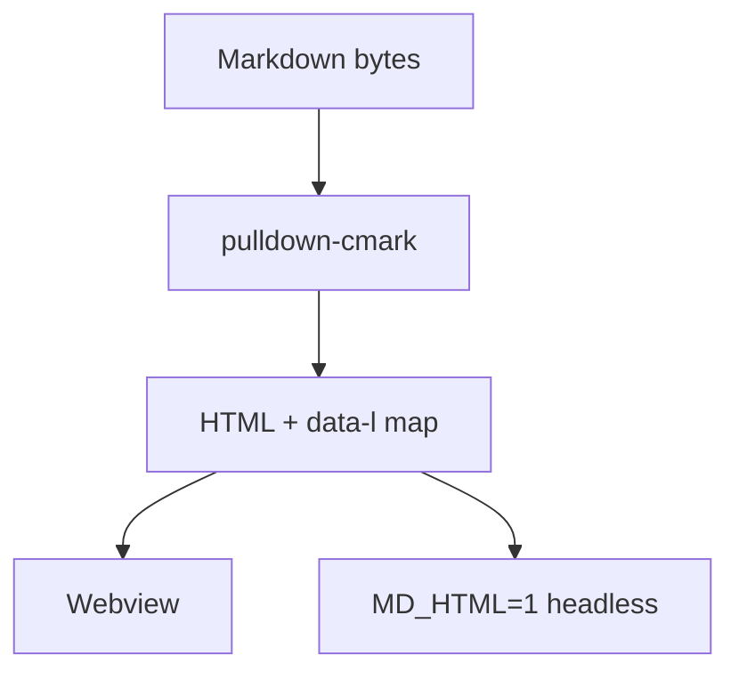

# Kitchen sink

The smoke test opens this file and asserts against it. Every feature Marklet claims to
render appears below exactly once, so a regression in any one of them fails a single,
fast test.

## Emphasis and inline

Plain, *emphasised*, **strong**, ***both***, ~~struck~~, `inline code`, and a
[link](https://example.com "with a title").

A footnote reference lives here[^why], and a second one here[^cost].

[^why]: Footnotes need a backlink to be useful, and the backlink is what usually breaks.
[^cost]: A second footnote proves the numbering and the backlink targets are distinct.

## An aligned table

Alignment is hand-written and must survive a round trip through the editor untouched.

| Component  | Installer |    Loaded when     |
|:-----------|----------:|:------------------:|
| Rust exe   |    3.0 MB |       always       |
| Mermaid    |    750 KB |  ```mermaid fence  |
| KaTeX      |    200 KB |  math delimiters   |
| CodeMirror |    180 KB |  F2 / F3 / Ctrl+E  |

## Lists

1. Ordered
2. Items
   - Nested unordered
   - With a second entry

- [x] A completed task
- [ ] An incomplete one

## Code

```rust
pub fn render(bytes: &[u8], opts: RenderOpts<'_>) -> RenderedDoc {
    let text = String::from_utf8_lossy(bytes);
    let parser = Parser::new_ext(&text, options());
    // The offset iterator is the primitive four features depend on.
    todo!()
}
```

```
A fence with no language must not be highlighted, and must not crash the highlighter.
```

## Math

Inline: $E = mc^2$. Block:

$$
\int_{0}^{1} x^2 \,dx = \frac{1}{3}
$$

## A diagram



## Wiki-links

A resolved link to [[kitchen-sink]] and an unresolved one to [[note-that-does-not-exist]].
The unresolved state is styled, not hidden — pointing at a note you have not written yet is
normal in a vault.

## Quote and rule

> Reading comfort beats visual interest. This is a tool people stare at for an hour.

---

## Local image


## Allowed raw HTML

<details>
<summary>The sanitizer allowlist is eight tags wide</summary>

Inside a `details` block: <kbd>Ctrl</kbd>+<kbd>E</kbd>, H<sub>2</sub>O, x<sup>2</sup>, and
<mark>a highlight</mark>.

</details>
